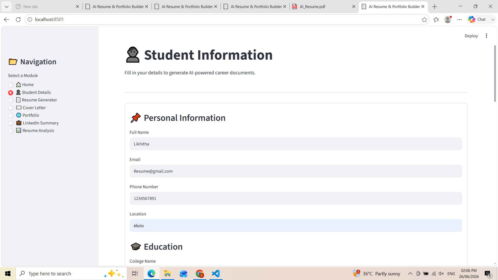
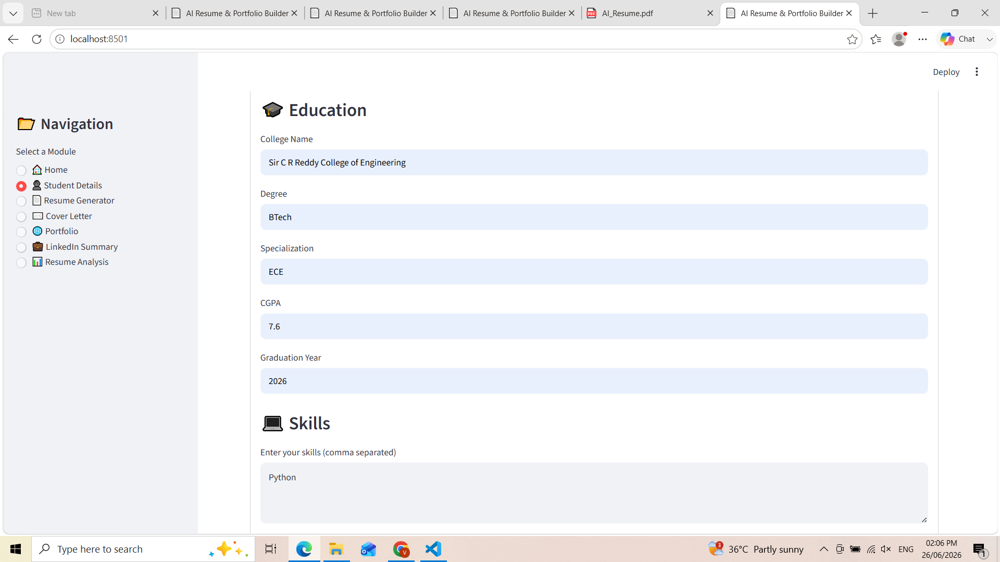
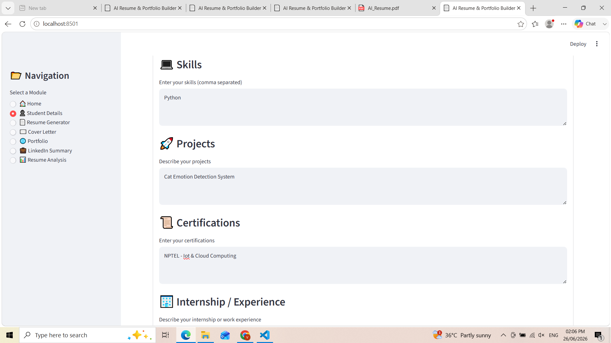
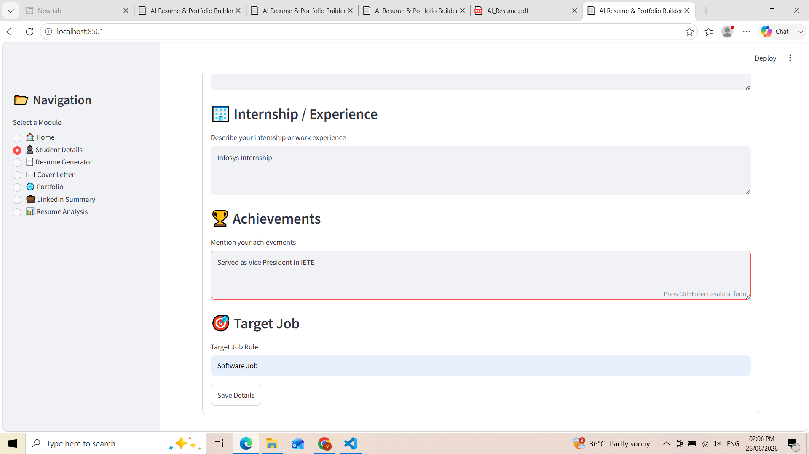
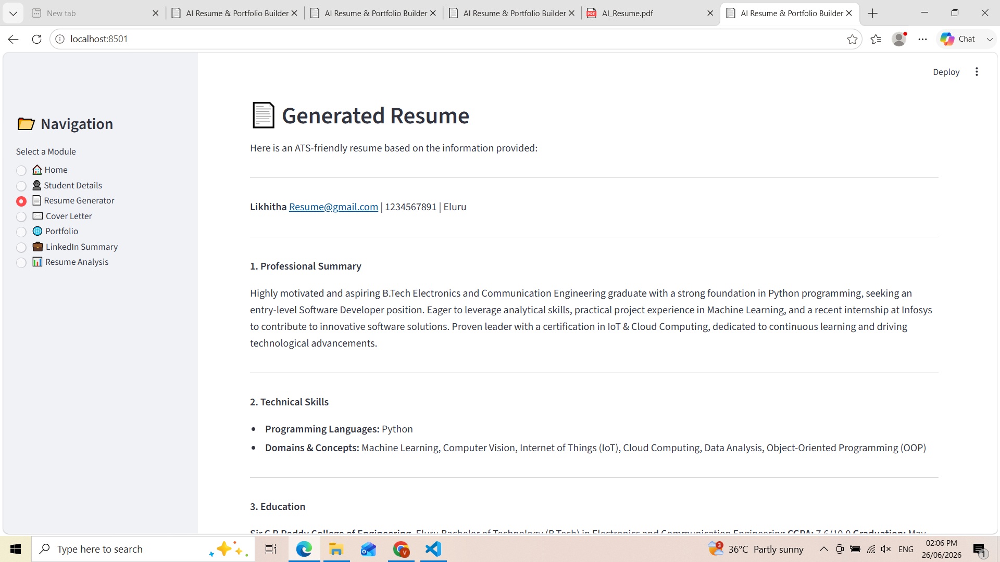
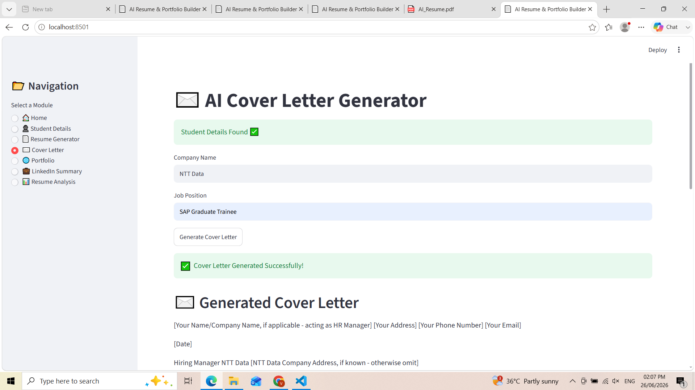
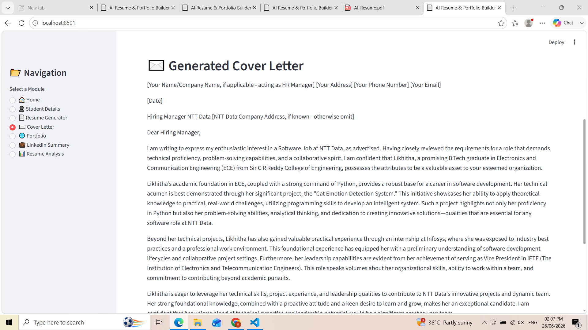
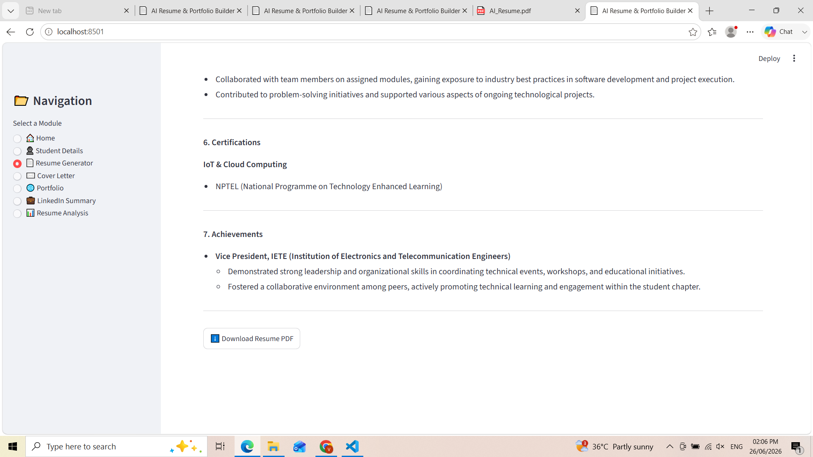
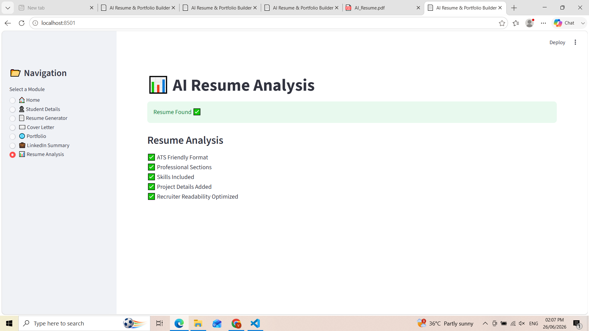

# 📄 AI Resume & Portfolio Builder

## 📌 Overview

AI Resume & Portfolio Builder is a Streamlit-based web application that helps students create professional career documents using Google's Gemini AI.

The application can generate:
- 📄 ATS-Friendly Resume
- ✉️ Professional Cover Letter
- 💼 LinkedIn Profile Summary
- 🌐 Portfolio Content
- 📊 Resume Analysis
- 📥 PDF Downloads

---

## 🚀 Features

- AI Resume Generation
- AI Cover Letter Generation
- AI LinkedIn Summary
- Portfolio Generator
- Resume Analysis
- PDF Export
- Modern Streamlit UI
- Google Gemini AI Integration

---

## 🛠️ Technologies Used

- Python
- Streamlit
- Google Gemini AI
- ReportLab
- python-dotenv

---

## 📸 Application Screenshots

### 🏠 Home Page



### 👤 Student Details







### 📄 Resume Generator



### ✉️ Cover Letter



### 💼 LinkedIn Profile



### 🌐 Portfolio



### 📊 Resume Analysis



---

## ▶️ Installation

```bash
git clone https://github.com/LikhithaVasa/AI-Resume-Portfolio-Builder.git

cd AI-Resume-Portfolio-Builder

pip install -r requirements.txt

streamlit run app.py
```

---

## 👩‍💻 Author

**Vasa Likhitha**
